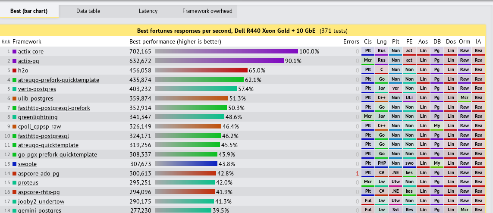

# Rust og minnetrygghet

Jeg har brukt begrenset erfaring

  * Rust + protobuf + influxdb + websocket + react
  * Rust + API + Mongdb + CLI 
  * Advent of code, for å komme i gang

---

## Automatisk minnehåndtering

* Uten garbage collector
* Ved hjelp av: Ownership, borrowing, references, lifetimes
  * I C-språk gjør du dette selv

---

## Automatisk minnehåndtering (2)

* Løser nye klasser med seriøse problemer
* Tryggere å refaktorere kode
* Tar code-review til et høyre nivå
  * Slipper å gå i detaljer

---

## Ingen runtime

* Ingen initialiseringskost, som i f.eks i Python
* Kan få «Parity» med C/C++
  * Kan kalle Rust fra C og motsatt

---

TODO Eksempler

---

## Safe concurrent programming

I tillegg til minnetrygghet får du:

* Hvilken tråd holder orden på hvilket objekt

---

TODO Eksempel

---

## Cross platform

* Cross platform CLI-verktøy er enkelt å skrive

---

## Hva med ytelse?

[Techempower benchmarks](https://www.techempower.com/benchmarks/)

[Debian benchmarks game](https://benchmarksgame-team.pages.debian.net/benchmarksgame/fastest/rust-gpp.html)

---

## Hva med læringskurve?

Læringskurva kan gjøre det vanskelig å komme i gang, men siden den er bratt kommer man fort ganske langt.

* 3.2 % bruker Rust (68 % bruker Javascript)
* 83.5 % elsker Rust
  * % of developers who are developing with the language or technology and have expressed interest in continuing to develop with it
* Høyest for fjerde år på rad

---

## Hvem bruker Rust i dag?

* Mozilla
* Microsoft
* Facebook
* Google
* Intel
* Amazon
* Dropbox
* Chef
* Fastly
* Baidu
* ...

---

### Facebook (1)

Overraskende hvem som hopper på Rust først
  * Python
  * Javascript

Nye brukere
  * 2-3 uker på å «diskturere» med kompilatoren
  * 3-5 uker så klarer man å gjøre ting ganske effektivt
  * 8+ uker for å skrive idiomatisk Rust

---

### Facebook (2)

Rust må være 10 ganger bedre enn det man bruker fra før for å være fristende nok til at folk vil bytte

* Alle som har evaluert Rust, har endt med å ta det i bruk
* Ingen angrer
* Bruker ingen tid på å debugge minnekorrupsjon eller race-conditions

---

### Mozilla

* Skreiv om CSS-komponenten av Firefox til Rust pga performance
* I tillegg fikk de tryggere kode
	* 74 % førre sikkerhetsbugs om de hadde hatt Rust-implementasjonen fra start
	* Men det finnes andre sikkerhetsbugs, og andre alvorlige bugs

---

### Microsoft

* Har gått gjennom kildekode fra siste 12 år
* 70 % av sikkerhetsbugs er minnerelatert
* Skriver om deler av Windows, bit for bit i Rust

---

# Referanser

* [Intel and Rust: the Future of Systems Programming: Josh Triplett](https://www.youtube.com/watch?v=l9hM0h6IQDo&feature=youtu.be)
* [Bringing Rust home to meet the parents, Jeremmy Fitzhange](https://www.youtube.com/watch?v=kylqq8pEgRs)
* [70 percent](https://www.zdnet.com/article/microsoft-70-percent-of-all-security-bugs-are-memory-safety-issues/)
* [Mozilla 74%](https://hacks.mozilla.org/2019/02/rewriting-a-browser-component-in-rust/)
* [Stackoverflow survey](https://insights.stackoverflow.com/survey/2019#most-loved-dreaded-and-wanted)

[Kjørende presentasjon](https://rust-memory-intro.now.sh) + [Kildekode](https://github.com/sigurdga/rust-memory-introduction)

---

## Historie

* 1.0 kom for fire år siden
* Men språket er ca åtte-ni år nå
* Kommer ny versjon hver sjette uke
* Vi er på versjon 1.39 nå
  * Med `async!`/`.await` stabilisert

---

## Binærstørrelse

* Ofte et negativt punkt at f.eks «Hello World» blir flere megabyte.
* Kan få det ned i 504 bytes, med en masse triks.

